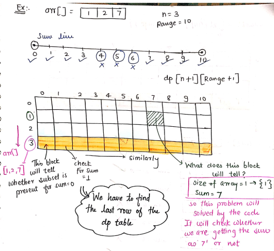

# knapsack/backsack

-   The knapsack problem is a classic problem in combinatorial optimization.
-   The goal is to determine the combination of items to include in the knapsack that maximizes the total value while keeping the total weight within the capacity of the knapsack.

## Types of Knapsack Problems:

1. **0-1 Knapsack Problem:**

-   In the 0-1 knapsack problem, items can either be included or excluded from the knapsack; you can't take fractions of items.
-   Formally, each item is represented by a pair (weight, value), and you can only take one instance of each item.
-   The task is to find the subset of items that maximizes the total value while keeping the total weight less than or equal to the knapsack's capacity.

2. **Fractional Knapsack Problem:**

-   In the fractional knapsack problem, fractions of items can be taken, meaning you can take a portion of an item if it maximizes the value.
-   Each item is represented by a pair (weight, value), and you can take any fraction of an item.
-   The goal is to maximize the total value of items taken while keeping the total weight less than or equal to the knapsack's capacity.

3. **Unbounded Knapsack Problem:**

-   In the unbounded knapsack problem, there's an unlimited supply of each item, and you can take any number of instances of each item.
-   Each item is represented by a pair (weight, value), and you can take multiple instances of an item.
-   The objective is to maximize the total value while keeping the total weight less than or equal to the knapsack's capacity.

## How to identify a knapsack Problem?

1. subset sum problem
2. equal sum partition
3. count of subset sum problem
4. minimum subset sum difference
5. target sum
6. No of subset with a given difference

# Q-1. [Subset sum](https://www.codingninjas.com/studio/problems/subset-sum-equal-to-k_1550954?leftPanelTabValue=PROBLEM)

You are given an array/list ‘ARR’ of ‘N’ positive integers and an integer ‘K’. Your task is to check if there exists a subset in ‘ARR’ with a sum equal to ‘K’.

Note: Return true if there exists a subset with sum equal to ‘K’. Otherwise, return false.

For Example :
If ‘ARR’ is {1,2,3,4} and ‘K’ = 4, then there exists 2 subsets with sum = 4. These are {1,3} and {4}. Hence, return true.

#### M-1. Recusive

```cpp
/*

    Time Complexity : O(2^N)
    Space Complexity : O(N)

    Where N is the number of elements in the array.


*/

int helper(vector < int > & arr, int n, int k) {
    // Base condition.
    if (n <= 0) {
        // If k = 0, we reached target sum.
        if (k == 0) {
            return 1;
        } else {
            return 0;
        }
    }

    // arr[n-1] not taken in considertion.
    int not_take = helper(arr, n - 1, k);
    int take = 0;
    if(k - arr[n-1] >= 0){
        // arr[n-1] taken in considertion.
        take = helper(arr, n - 1, k - arr[n-1]);
    }

    // Return current result.
    return not_take || take;
}

bool subsetSumToK(int n, int k, vector < int > & arr) {
    // Calling recursive function.
    return helper(arr, n, k);

}
```

#### M-2. Memoization

```cpp
/*

    Time Complexity : O(N * K)
    Space Complexity : O(N * K)

    Where N is the number of elements in the array and
    K is the target sum.


*/

int helper(vector < int > & arr, int n, int k, vector < vector < int >> & memo) {
    // Base condition.
    if (n <= 0) {
        // If k = 0, we reached target sum.
        if (k == 0) {
            return 1;
        } else {
            return 0;
        }
    }

    // If memo[n][k] not equal to -1
    // then result of n,k already calculated.
    if (memo[n][k] != -1) {
        return memo[n][k];
    }


    // arr[n-1] not taken in considertion.
    int x = helper(arr, n - 1, k, memo);
    int y = 0;
    if(k - arr[n-1] >= 0){
        // arr[n-1] taken in considertion.
        y = helper(arr, n - 1, k - arr[n-1], memo);
    }

    // Store current result in memo.
    memo[n][k] = x || y;
    // Return current result.
    return memo[n][k];
}

bool subsetSumToK(int n, int k, vector < int > & arr) {
    // Declaring memo array and storing -1 in it:
    vector < vector < int >> memo(n+1, vector < int > (k+1, -1));
    // Calling recursive function.
    return helper(arr, n, k, memo);
}
```

#### M-3. Tabulation

```cpp
/*

    Time Complexity : O(N * K)
    Space Complexity : O(N * K)

    Where N is the number of elements in the array and
    K is the target sum.


*/
bool subsetSumToK(int n, int k, vector<int>& arr) {
    // Declaring table and initializing it.
    vector<vector<int>> dp(n + 1, vector<int>(k + 1, 0));

    // Base case initialization.
    // If sum is 0, answer is always true for any n.
    for (int i = 0; i <= n; ++i)
        dp[i][0] = 1;

    // Fill the table bottom-up.
    for (int i = 1; i <= n; ++i) {
        for (int j = 1; j <= k; ++j) {
            // If current element can't be included.
            if (j < arr[i - 1]) {
                dp[i][j] = dp[i - 1][j];
            }
            // If current element can be included.
            else {
                dp[i][j] = dp[i - 1][j] || dp[i - 1][j - arr[i - 1]];
            }
        }
    }

    // The answer will be in the last cell of the table.
    return dp[n][k];
}

```

# Q-2. [Partition subset equal sum](https://leetcode.com/problems/partition-equal-subset-sum/)

-   Partition equal sum means sum of some ele = sum of rem ele
-   if sum is odd => we can't partion
-   so call for subSetSum(arr, n/2) => same as subset sum problem

#### M-1. Brute Force

```cpp
class Solution {
public:
    bool canPartition(vector<int>& nums, int i = 0, int sum1 = 0, int sum2 = 0) {
        if(i >= size(nums)) return sum1 == sum2;                    // check if both subset have equal sum
        return canPartition(nums, i+1, sum1 + nums[i], sum2)        // try including into subset-1
		    || canPartition(nums, i+1, sum1, sum2 + nums[i]);       // try including into subset-2
    }
};
```

We can slightly optimize the above approach by observing that equal partion are only possible when the total sum of array can be equally split, i.e, it is even. This effectively allows us to directly return false if the sum is odd. When the sum is even, we only need to check if we can construct one subset with its sum equal to total_sum / 2 (the other will automatically have the same sum, so we dont need to care about it). Thus the above can be optimized to -

```cpp
TC?SC -> 2^N/N
class Solution {
public:
    bool canPartition(vector<int>& nums) {
        int totalSum = accumulate(begin(nums), end(nums), 0);
        if(totalSum & 1) return false;
        return subsetSum(nums, totalSum / 2);
    }
    bool subsetSum(vector<int>& nums, int sum, int i = 0) {
        if(sum == 0) return true;                         // subset formed with required half-sum
        if(i >= size(nums) || sum < 0) return false;
        return subsetSum(nums, sum - nums[i], i + 1)      // include current element
            || subsetSum(nums, sum, i + 1);               // exclude current element
    }
};
```

#### M-2. Memo

```cpp
TC/SC N*sum/N*sum
class Solution {
public:
    int8_t dp[201][10001] = {[0 ... 200] = {[0 ... 10000] = -1}};  // all initialized to -1 (use dynamic vector to generalize to higher array size & possible sums)
    bool canPartition(vector<int>& nums) {
        int totalSum = accumulate(begin(nums), end(nums), 0);
        if(totalSum & 1) return false;
        return subsetSum(nums, totalSum / 2);
    }
    bool subsetSum(vector<int>& nums, int sum, int i = 0) {
        if(sum == 0) return true;
        if(i >= size(nums) || sum < 0) return false;
        if(dp[i][sum] != -1) return dp[i][sum];
        return dp[i][sum] = subsetSum(nums, sum - nums[i], i + 1) || subsetSum(nums, sum, i + 1);
    }
};
```

#### M-3. Tabulation

```cpp
class Solution {
public:
    bool canPartition(vector<int>& nums) {
        int n = nums.size(),sum=0;
        for(int i=0;i<n;i++){sum += nums[i];}

        if(sum % 2 != 0){return false;}
        sum /= 2;
        vector<vector<bool>> dp(n + 1, vector<bool>(sum + 1, false));

        dp[0][0] =true;

        for (int i = 1; i < n+1; i++) dp[i][0] = true;

        for (int j = 1; j < sum+1; j++) dp[0][j] = false;

        for (int i = 1; i < n+1; i++) {
            for (int j = 1; j < sum+1; j++) {
                dp[i][j] = dp[i-1][j];
                if (j >= nums[i-1]) {
                dp[i][j] = (dp[i][j] || dp[i-1][j-nums[i-1]]);
                }
            }
        }
        return dp[n][sum];


    }


};
```

#### M-4. Optimized tabulation

```cpp
class Solution {
public:
    bool canPartition(vector<int>& nums) {
        int totalSum = accumulate(begin(nums), end(nums), 0), halfSum = totalSum / 2;
        if(totalSum & 1) return false;
        bool dp[halfSum+1]; memset(dp, false, sizeof dp);
        dp[0] = true;                              // 0 sum is always achievable
        for(int num : nums)
            for(int j = halfSum; j >= num; j--)    // essential to start right to left
                if(dp[j - num])                    // if j - num was previously achievable
                    dp[j] = true;                  // we can add num to it and make j achievable as well

        return dp[halfSum];
    }
};
```

# Q-3 [Count of subset sum](https://www.codingninjas.com/codestudio/problems/count-of-subsets-with-sum-equal-to-k_1550955?leftPanelTabValue=PROBLEM)

#### M-1. Memoization

```cpp
int dp[1001][1001];

const int MOD = 1e9 + 7;

int helper(vector<int>& a, int k, int i) {
    if (i >= a.size()) {
        if (k == 0) {
            return 1;
        }
		return 0;

    }

    if (dp[k][i] != -1) {
        return dp[k][i];
    }

    int not_take = helper(a, k, i + 1)%MOD;
    int take = 0;
    if (k - a[i] >= 0) {
        take = helper(a, k - a[i], i + 1)%MOD;
    }
    return dp[k][i] = (not_take + take)%MOD;
}

int findWays(vector<int>& arr, int k) {
    memset(dp, -1, sizeof(dp));
    return helper(arr, k, 0);
}
```

#### M-2 Tabulation

```cpp
int dp[1001][1001];

const int MOD = 1e9 + 7;

int findWays(vector<int>& arr, int k) {
	int n = arr.size();

	dp[0][0] = 1;
	//dp[i][k]

	for(int i=1; i<=k; ++i){
		dp[0][i] = 0;
	}

	for(int i=1; i<=n; ++i){
		for(int j=0; j<=k; ++j){
			dp[i][j] = dp[i-1][j];
			if(j-arr[i-1] >= 0){
				dp[i][j] = (dp[i][j] + dp[i-1][j-arr[i-1]])%MOD;
			}
		}
	}
	return dp[n][k];
}
```

# Q-4 [Partition Array Into Two Arrays to Minimize Sum Difference](https://leetcode.com/problems/partition-array-into-two-arrays-to-minimize-sum-difference/)

-   same as subset sum
-   divide array into 2 such parts such that diff in sum = min
-   min diff = if we can divide into 2 parts of equal sum = 0
-   max diff = totalSum - 0 = totalSum
-   Range = ? 0 ... sum(arr)
-   S1, S2 => min(s1-s2) => min(s2-s1) => min((range-s1)-s1) => min(range-2*s1) => min(sum-2*s1)
-   so, we have to find s1 such that min(sum-2\*s1)



-   so we only need to have last row, add it to a vector
-   THose are s1's => loop it and find min(sum-2\*s1)

**Note** -> Only works for positive integres of array, if negative int => negative sum => not possible to store in table

```cpp
class Solution {
public:
    int minimumDifference(vector<int>& nums) {
        int n = nums.size();
        if (n == 0) return 0; // Handling empty input

        int sum = accumulate(nums.begin(), nums.end(), 0);
        vector<vector<bool>> dp(n + 1, vector<bool>(sum + 1, false));

        dp[0][0] = true;

        for (int i = 1; i <= n; i++) {
            dp[i][0] = true;
        }

        for (int i = 1; i <= n; i++) {
            for (int j = 1; j <= sum; j++) {
                dp[i][j] = dp[i - 1][j];
                if (j >= nums[i - 1]) {
                    dp[i][j] = dp[i][j] || dp[i - 1][j - nums[i - 1]];
                }
            }
        }

        int ans = INT_MAX;
        for (int k = sum / 2; k >= 0; --k) {
            if (dp[n][k] == true) {
                ans = min(ans, sum - 2 * k);
                break; // Since we are minimizing, the first valid answer is the best.
            }
        }
        return ans;
    }
};

```
